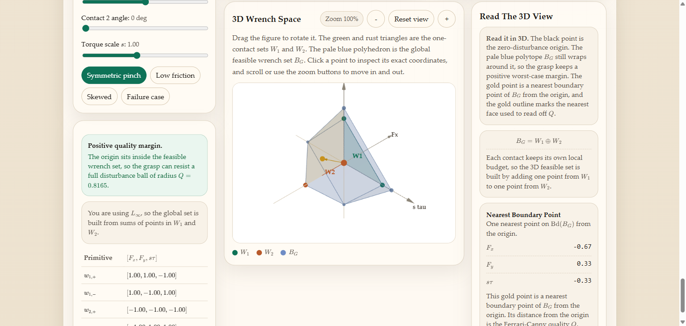

# Planning Optimal Grasps HTML Demo

A standalone HTML explainer for Ferrari and Canny's 1992 paper, *Planning Optimal Grasps*.

This repo turns the paper into a readable, interactive page with:

- a plain-language walkthrough of the main ideas
- paper-faithful notation rendered with LaTeX via KaTeX
- a rotatable 3D wrench-space viewer
- live switches between the `L_\infty` and `L_1` grasp criteria
- informative presets, including a failure case where the quality collapses to zero



## Why this exists

The original paper is important but notation-heavy. This demo is meant to be a paper replacement for the planar case: something you can read top-to-bottom, then manipulate to build intuition for wrench sets, Minkowski sums, convex hulls, and Ferrari-Canny quality `Q`.

## Files

- `index.html`: the full interactive paper replacement
- `vendor/katex`: local math rendering assets
- `vendor/three`: local 3D viewer assets
- `serve_demo.py`: lightweight local server launcher

## Run it

Run:

```bash
python serve_demo.py
```

### Manual

Serve the folder locally:

```powershell
python -m http.server 8765
```

Then open:

```text
http://127.0.0.1:8765/
```

## What to look at first

1. Read the `Why There Are Two Criteria` section.
2. Open the interactive lab.
3. Start with the symmetric preset.
4. Toggle between `L_\infty` and `L_1`.
5. Try the failure preset and watch `Q` collapse to zero.

## Paper context

- Paper: Ferrari, C. and Canny, J., 1992, *Planning Optimal Grasps*
- This demo focuses on the planar wrench-space case shown in the paper.
- The paper PDF is not included in this repo.

## Notes

- No build step is required.
- The page is fully local once the folder is served.
- The 3D viewer uses vendored `three.js` modules, and math rendering uses vendored KaTeX assets.
